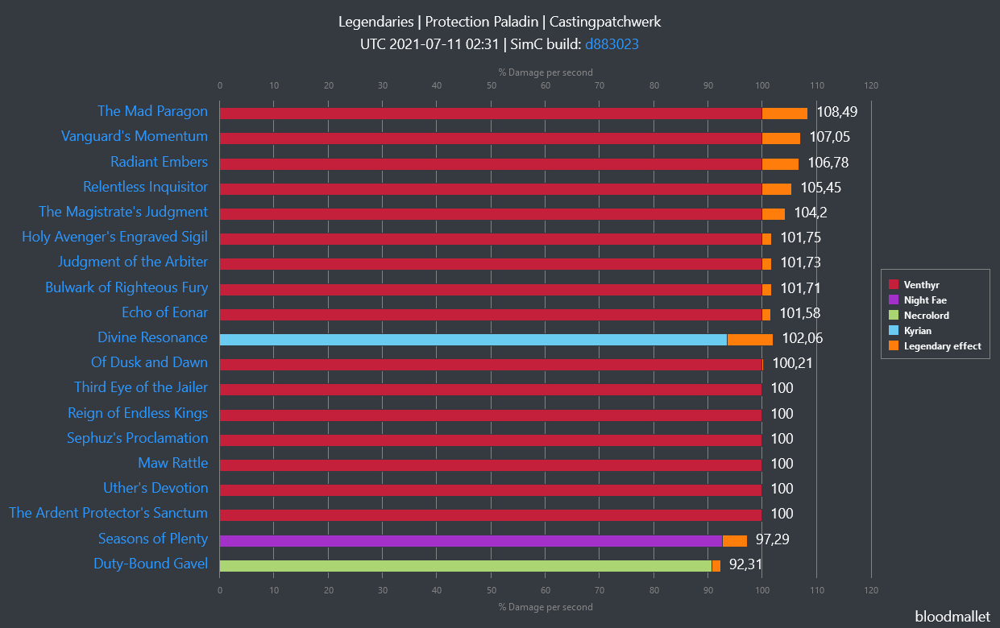

# Fallback profiles
## What?
Fallback profiles are used if 
[SimulationCraft](https://github.com/simulationcraft/simc) doesn't
have some profiles. E.g. for specific fight styles or Covenants.

## Why?
If you want your spec to be simulated in e.g. `hecticaddcleave` with a
different profile than the current SimulationCraft stacked chart profile,
you can provide a fitting profile here.

Additionally Covenant specific profiles either in SimulationCraft or here, will 
enable Covenant specific Legendaries to be shown properly.

## How?
Provide and update a profile via 
[Pull Request](https://github.com/Bloodmallet/bloodytools/pulls) (against 
`dev`-branch) or 
[Ticket](https://github.com/Bloodmallet/bloodytools/issues/new) in 
[bloodytools](https://github.com/Bloodmallet/bloodytools).

### Naming scheme
Files need to follow SimulationCrafts naming scheme: `T<NUMBER>_<CLASS>_<SPEC>[_<COVENANT>].simc`
E.g.:
- T27_Shaman_Elemental.simc
- T27_Shaman_Elemental_Night_Fae.simc
- T27_Warrior_Fury_Venthyr.simc

### Location
Files need to be placed in an appropriate sub-directory next to this file. Directory scheme: `<FIGHT_STYLE>/Tier<NUMBER>/`. FIGHT_STYLE needs to be in lower cases.
E.g. full file path:
- `/fallback_profiles/README.md` we're here
- `/fallback_profiles/patchwerk/Tier27/T27_Shaman_Elemental.simc` will be used in case SimulationCrafts base profile does not exist
- `/fallback_profiles/hecticaddcleave/Tier27/T27_Shaman_Elemental.simc` will overwrite SimulationCrafts base profile for hecticaddcleave
- `/fallback_profiles/hecticaddcleave/Tier27/T27_Shaman_Elemental_Night_Fae.simc` will provide a Covenant specific overwrite for hecticaddcleave

## Order
Profiles are loaded in the following order. Later loads overwrite earlier ones
1. fallback Covenant profiles
2. SimulationCraft Covenant profiles
3. fallback baseline profile
4. SimulationCraft baseline profile for patchwerk and castingpatchwerk fight, or if no fallback was found
5. custom profile
6. the winner of the previous 3 steps overwrites the matching Covenant specific profile

## Special mentions
`patchwerk` and `castingpatchwerk` fight styles will both be fueled by one directory: `patchwerk`
